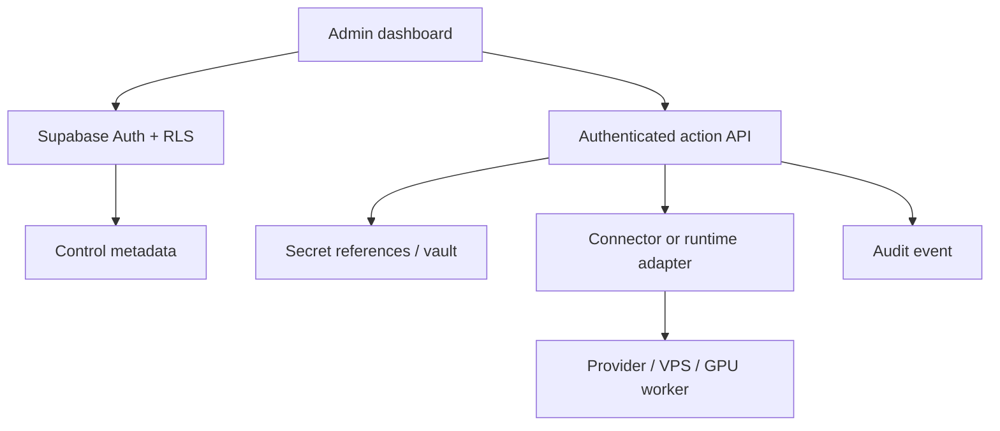

# Vision Smart Studio — Administrative Control Plane

## Purpose

Define the dedicated administration environment that governs platform settings, connector bindings, hosting targets, execution workers, AI providers/models, routing policies, security references and audit evidence. This document owns the administrative UX and control-plane contract; vendor adapters remain owned by `CONNECTORS-AND-MODELS.md`.

The control plane manages declared state and requests consequential actions through authenticated service boundaries. It never places raw credentials, SSH material, provider tokens or privileged remote commands in browser state.

## Administrative roles

| Role | Read inventory | Configure | Operate | Manage access | Read audit |
| --- | --- | --- | --- | --- | --- |
| `admin` | Yes | Yes | Yes | Yes | Yes |
| `operator` | Yes | Yes | Yes | No | Yes |
| `auditor` | Yes | No | No | No | Yes |
| `viewer` | Yes | No | No | No | No |

Authorization is enforced at the database/service boundary. Hiding a control in the UI is not authorization. Role data must come from protected membership/application metadata, never user-editable profile metadata.

## Dedicated interface

The administrator receives one responsive dashboard with seven explicit areas:

1. **Overview** — inventory totals, degraded resources, pending authorization, operational mode and recent audit outcomes.
2. **Connections** — connector definitions/bindings, protocol, capabilities, scopes, environment, secret reference, lifecycle and health.
3. **Infrastructure** — hosting targets and local/cloud/VPS CPU/GPU workers, capacity, utilization, maintenance and health.
4. **Models** — external and internal/open-source providers, model catalog, runtime/deployment binding, capabilities, lifecycle, verification and health.
5. **Routing** — external/internal/hybrid policies, confidentiality, cost, latency, capacity and bounded fallback.
6. **Security** — memberships, roles, secret references, environment isolation and policy state. Secret values are never displayed.
7. **Audit** — append-oriented consequential-action records with actor, target, environment, result and correlation id.

Every visible action must either complete a real validated transition or state the unmet prerequisite. No button may manufacture a successful connection, model installation, worker health or external execution.

## Managed resources

### Connector binding

Required metadata: workspace, display name, connector kind, protocol, environment, normalized capabilities, required scopes, endpoint, non-secret configuration, secret reference, adapter version, lifecycle and health.

Lifecycle:

`draft -> configured -> authorization_required -> checking -> active -> degraded -> disabled -> archived`

Only an authenticated adapter result may move a binding to `active` or set a fresh health result.

### Hosting target and worker

Targets represent Netlify/Vercel-style platforms, generic cloud/VPS, on-premise machines, Docker/Nginx hosts, databases or storage. Workers represent controlled local/cloud/VPS CPU/GPU execution capacity attached to a target when applicable.

Worker lifecycle:

`registered -> provisioning -> ready -> busy -> maintenance -> offline -> retired`

Capacity and telemetry distinguish declared hardware from observed utilization. A browser-entered value is declared inventory, not verified telemetry.

### AI provider, model and deployment

Provider/model records remain vendor-neutral. Internal/open-source models declare runtime, artifact/version reference, modalities, context, tool support, confidentiality eligibility and CPU/RAM/GPU/VRAM/storage requirements. A model deployment binds a model to a worker/runtime without storing model binaries in Git or Postgres.

Model lifecycle:

`registered -> installing -> verifying -> available -> active -> maintenance -> failed -> retired`

Installation, activation, upgrade, rollback and removal are consequential operations. They require an authorized runtime adapter, audit evidence and safe failure behavior.

### Routing policy

A policy defines operating mode (`external`, `internal` or `hybrid`), allowed trust classes, capability/modalities, confidentiality rule, cost ceiling, latency target, capacity guard, ordered fallback and confirmation requirements. Explicit user selection wins unless a mandatory security rule rejects it. Internal-only work must never fall back silently to an external provider.

## Trust boundaries

- The public client uses a Supabase publishable key and authenticated user JWT only.
- Privileged keys and connector credentials remain in trusted backend/vault boundaries.
- RLS applies to every exposed table and scopes rows by workspace membership and role.
- Consequential action APIs re-check user identity, workspace role, resource state, environment and policy.
- Remote endpoints must be protected against SSRF, replay, arbitrary command injection and unbounded retries.
- Production actions require the validation/release gate in addition to administrator privilege.

## Persistence contract

The development control plane uses Supabase Postgres for durable administration records. Browser-local Phase 1 project state remains separate until an approved project-state migration is implemented. The control schema contains no raw secrets and does not turn a repository URL or secret label into a live connector automatically.

All administrative tables use UUID primary keys, workspace ownership, bounded enums/checks, UTC timestamps, useful indexes, RLS and least-privilege grants. Audit records are append-oriented; ordinary clients cannot rewrite or delete them.

## Failure and concurrency rules

- Mutations reject invalid state transitions and stale versions.
- Double submissions are idempotent or blocked.
- Dependent resources prevent unsafe archival/removal.
- A failed health check preserves the last successful observation and records the new failure separately.
- Provider/network failure never changes declared configuration into a false success.
- Loading, empty, unauthorized, degraded and unavailable states are visible in the UI.

## Delivery sequence

1. Commit this contract and the roadmap/validation/security changes.
2. Create the Supabase schema, RLS, grants and audit rules; run advisors and negative permission tests.
3. Implement typed domain/application boundaries and a Supabase adapter.
4. Deliver the dedicated responsive dashboard and role-aware controls.
5. Add authenticated action endpoints and adapters incrementally, one provider/runtime capability at a time.
6. Validate CI, browser flows, deployment, headers, database effects and rollback evidence.

## Acceptance criteria

- An authenticated administrator can manage settings and every declared inventory type from one dedicated interface.
- Operator, auditor and viewer restrictions are enforced server-side and reflected in the UI.
- Connector, hosting, worker, provider, model, deployment and routing records persist and resume.
- Internal/open-source models expose lifecycle, resource requirements, worker binding and health without storing binaries in Git/database.
- Connection/model/worker actions cannot report success without a verified adapter result.
- Raw secrets never enter source, browser persistence, public database columns, logs or screenshots.
- Environment and workspace boundaries, audit attribution, idempotency and stale-update handling are tested.
- Desktop, tablet and mobile flows, keyboard access, errors and empty states are verified.
- Typecheck, lint, automated tests, dependency audits, production build, CI and deployed-preview smoke checks pass.

Actual VPS/model operations additionally require an enrolled reachable target, approved credentials in a backend vault and a compatible runtime adapter. Absence of those external bindings is reported as a prerequisite, never as completed execution.

## Implemented baseline — 2026-09-02

The dedicated `/admin` surface, Supabase schema, forced RLS, least-privilege grants, workspace bootstrap, four roles, action/routing integrity triggers, atomic transition RPC, e-mail invitation Edge Function, exact-origin CSP, generated database types and automated control-plane tests are implemented. `ADMIN-OPERATIONS.md` owns the deployment and operating runbook.

This baseline completes the administrative management surface and secure request plane. It does not collapse the connector/runtime adapter phases into the browser: external VPS commands, model installation and provider execution remain pending until their capability-specific trusted adapters and vault bindings are delivered and verified.
